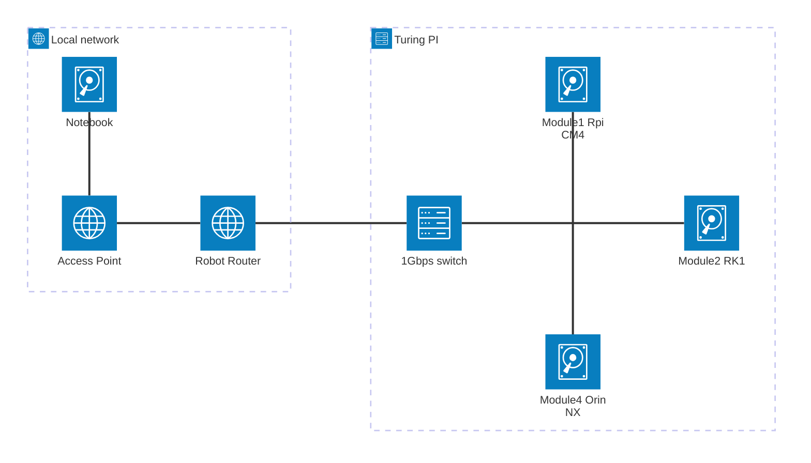

# foldy

Foldy is a small inter module project using ROS 2, nav2 stack and different inference models. The goal is to experiment with different configurations for a robot exploring its environment and taking decisions based on visual and audio cues.

In order to enhance and try different things this project levels up a Turing Pi 2 board running different computing modules which each levels up different advantages of the hardware.

Everything is run on Docker images and (optionally) this can be alter orchastrated in such a way that allow quickly optimise and change the roles and functions of the platform.

Everything runs on top of an old an unexpensive Neato Botvac D5.

This is a personal exploration project looking into distributed systems with hardware specific roles. This system is compared against a similar NUC or embebbed computer. We can differentiate advantages and disadvantages of the proposed system:


## Hardware configuration

The involved hardware is as follows:

- [Turing Pi V2](https://docs.turingpi.com/docs/turing-pi2-intro) motherboard
- [Raspberry Pi 4 computer module](https://www.raspberrypi.com/products/compute-module-4/) as Module 1.
- [RK1 16GB](https://turingpi.com/product/turing-rk1/?attribute_ram=8+GB) computer for high speed processing unit on Module 2.
- [Orin NX 16 GB](https://www.nvidia.com/es-la/autonomous-machines/embedded-systems/jetson-orin/) for GPU and inference unit on Module 4.

As module 1 a Raspberry Pi 4 computer module was chosen. This allows the system to use the IO pins on the Turing Pi board and run any Raspberry Pi shield easily leveling up this platform available hardware for actuators.

RK1 16GB board follows as 2D mapping and navigation computer levelling up an USB connection to the Neato Base as module 2. It uses its powerful Rockchip RK3588 SoC with four Cortex-A76 cores and four Cortex-A55 cores.

Orin NX is the third module available used on the socket 4. It runs a CPU Arm® Cortex®-A78AE with 8 cores and a NVIDIA GPU with 1024 CUDA cores and 32 tensor cores up to 67 INT8 TOPS. It has access to the USB hub which is connected to:
- Jabra Speak 410
- Realsense D435i
It uses these as environment sensors which are used to by different AI componenets running on the device.

Module 3 is available for future expansion for additional processing capabilities.

## Network configuration

The system levels up an internal switch on the motherboard (1Gbps Switch, RTL8370MB-CG+) which it is also connected to one of the ethernet ports to a [GL.iNet GL-AR300M16](https://store.gl-inet.com/products/gl-ar300m16-mini-smart-router?variant=39350896787550) mini wireless pocket router which connects to the Wireless networks and provides access to all the modules over SSH.




## Installation

### RK1 computer setup:

1) Clone the directory:
```
$ git clone 
```

2) Go to the folder of the projectand build the project.
```
$ cd foldy
$ docker compose -f docker-compose-neato.yaml build
```

## Bring up Neato docker images:

### Start the base
```
$ docker compose -f docker-compose-neato.yaml up -d --force-recreate neato-base ros2-base
```

### Mapping
```
$ docker compose -f docker-compose-neato.yaml up -d --force-recreate neato-base ros2-base neato-cartographer
```

#### Save map:
```
$ ros2 run nav2_map_server map_saver_cli --free 0.196 --ros-args -p save_map_timeout:=5000.0
```

### Visualise the map:
```
$ xhost + && docker compose -f docker-compose-desktop.yaml up -d
```

## Navigation

On RK1:
```
docker compose -f docker-compose-neato.yaml up -d --force-recreate neato-base ros2-base
```

On the Desktop PC:
```
xhost + && docker compose -f docker-compose-desktop.yaml up rviz2-nav -d --force-recreate
```